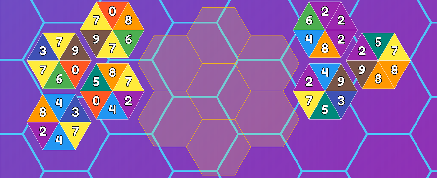

# 

Hexasperate is an edge-matching puzzle game inspired by TetraVex.

**Play Hexasperate at [hexasperate.com](https://www.hexasperate.com)**

## How to Play

The goal of Hexasperate is to place all the hexagonal tiles in the grid so that everywhere two hexagons touch, the colors match.

Tiles can be dragged with the mouse:
* Left clicking and dragging any hexagon moves that one hexagon.
* Right clicking a hexagon in the grid and dragging it will move it and all tiles connected to it.

### A new game of Hexasperate with no tiles placed yet

### A completed puzzle

## Links

* [Play TetraVex on archive.org](https://archive.org/details/win3_TetraVex)

## License
Copyright 2020 Tom Smilack

Hexasperate is free software: you can redistribute it and/or modify
it under the terms of the GNU General Public License as published by
the Free Software Foundation, either version 3 of the License, or
(at your option) any later version.

Hexasperate is distributed in the hope that it will be useful,
but WITHOUT ANY WARRANTY; without even the implied warranty of
MERCHANTABILITY or FITNESS FOR A PARTICULAR PURPOSE.  See the
GNU General Public License for more details.

You should have received a copy of the GNU General Public License
along with Hexasperate.  If not, see <https://www.gnu.org/licenses/>.
